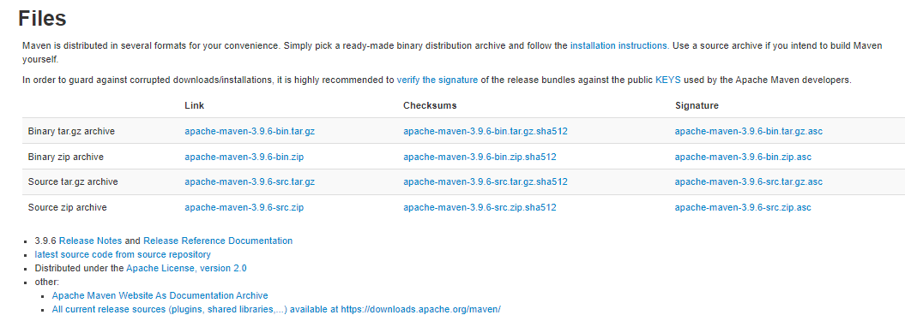
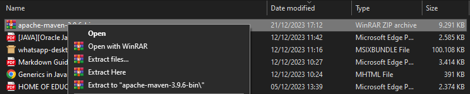
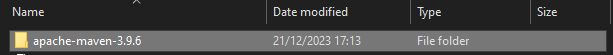
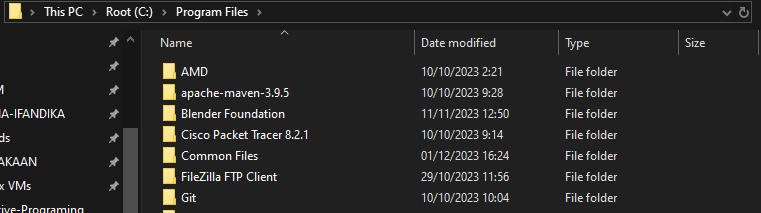
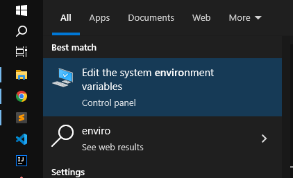
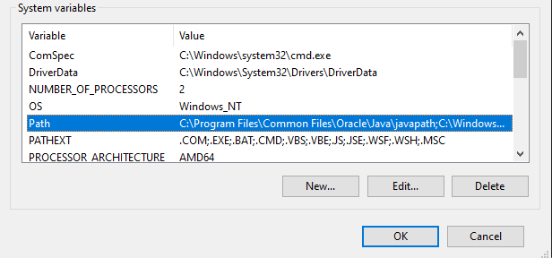
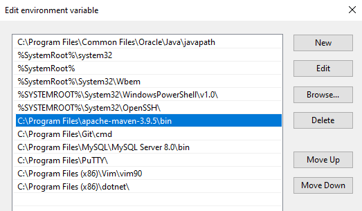
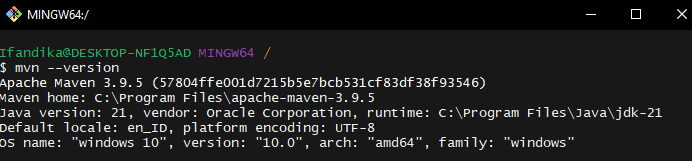

# Tutorial Maven
#
## 1. Pendahuluan
Maven adalah ***Build Tools***(alat otomatisasi pembangunan) yang ***Open Source***, digunakan terutama untuk projek Java dengan konsep POM (Project Object Model). Juga digunakan untuk membangun projek yang ditulis dalam C#, Ruby, Scala, dan bahasa pemprograman lainnya. Maven dibuat oleh The Apache Software Foundation.

## 2. Instalasi
Instalasi pada Windows dan Linux.
#### Windows
Untuk Windows berikut langkahnya:

1. Download maven  
	- [Download Apache Maven](https://maven.apache.org/download.cgi)
	
	

	Pilih pada tipe binary, untuk downloa tekan pada link berwarna biru.

	- Binary tar.gz archive
	- Binary zip archive

2. Extract Apache Maven  
	Extract file Apache Maven.
	

	Setelah di ekstrak.

	

3. Pindah Hasil Ekstrak  
	Pindah file apache maven yang sudah di ektrak ke  
	C:\ProgramFiles

	

4. Setup Environment  
	Lalu setup/konfigurasi di envirtonment, dengan search "envi".  
	

	Lalu ke System **Properties > Advanced > Environment Variables > System Variables > Path (Klik 2x)**

	

	Lalu masukan path file apache maven yang ditempatkan di C:\ProgramFiles. Klik new lalu masukan path/alamatnya. Bisa

	- C:\Program Files\apache-maven-3.9.5
	- C:\Program Files\apache-maven-3.9.5\bin

	

5. Tes Lewat Terminal  
	Disini tes menggunakan terminal MINGW64 dari git.

	